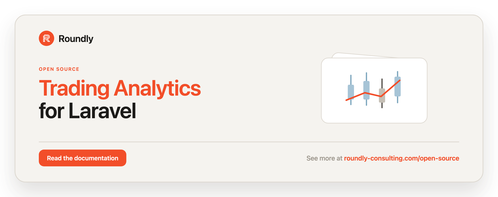

<!-- roundly-hero:start -->
<p align="center">
  <a href="https://roundly-consulting.com/open-source/docs/trading-analytics-for-laravel?utm_source=github&utm_medium=readme&utm_campaign=open-source&utm_content=trading-analytics-for-laravel">
    
  </a>
</p>
<!-- roundly-hero:end -->

<!-- roundly-badges:start -->
<p align="center">
  <a href="https://packagist.org/packages/roundly-consulting/trading-analytics-for-laravel"></a>
  <a href="https://github.com/roundly-consulting/trading-analytics-for-laravel/actions/workflows/run-tests.yml"></a>
  <a href="https://github.com/roundly-consulting/trading-analytics-for-laravel/actions/workflows/fix-php-code-style-issues.yml"></a>
  <a href="https://donate.stripe.com/dRmeVe8FX5PF1Qd9pXcEw00"></a>
</p>
<!-- roundly-badges:end -->

# Trading Analytics for Laravel

Calculate trading performance analytics — P&L, returns, drawdown, expectancy, risk-adjusted
ratios and more — for Laravel, with arbitrary-precision `bcmath` arithmetic.

Feed it a `LazyCollection` of `Trade` objects and it computes a full matrix of trading
performance metrics, broken down globally and per trading pair / base currency / quote currency.
Every amount is computed with `bcmath` and returned as a string-backed value object, so there is
no floating-point drift.

## Requirements

- PHP `^8.4`
- Laravel `^12.0` or `^13.0`
- The `bcmath` PHP extension

## Installation

```bash
composer require roundly-consulting/trading-analytics-for-laravel
```

The service provider is auto-discovered. The package ships no migrations, views, or commands —
it is a calculation library you use directly in your own code.

Optionally publish the config file to change the default precision or win-rate period:

```bash
php artisan vendor:publish --tag="trading-analytics-config"
```

## Configuration

The package works with zero configuration; publishing the config file only lets you change the
defaults in one place. `config/trading-analytics.php`:

```php
return [
    // Default decimal precision (bcmath scale) for every calculation.
    'scale' => (int) env('TRADING_ANALYTICS_SCALE', 10),

    // Default win-rate bucketing period: daily, weekly, or monthly.
    'win_rate_period' => env('TRADING_ANALYTICS_WIN_RATE_PERIOD', 'daily'),
];
```

| Key | Type | Default | Env var | Purpose |
|---|---|---|---|---|
| `scale` | `int` | `10` | `TRADING_ANALYTICS_SCALE` | Decimal places used when a run does not call `->scale()`. |
| `win_rate_period` | `string` | `daily` | `TRADING_ANALYTICS_WIN_RATE_PERIOD` | Win-rate bucket when a run does not call `->usingWinRatePeriod()`. An unrecognised value falls back to `daily`. |

A run's explicit `->scale(...)` / `->usingWinRatePeriod(...)` always overrides the configured
default. Outside a booted Laravel app (no config bound), the built-in defaults (`scale` 10,
`daily`) apply automatically.

## Usage

### Building trades

A `Trade` is an immutable value object. The quickest way to build one is `Trade::make()`, which
takes plain scalars and wraps the numeric fields for you:

```php
use Illuminate\Support\Carbon;
use RoundlyConsulting\TradingAnalytics\DataTransferObjects\Trade;
use RoundlyConsulting\TradingAnalytics\Enums\Direction;

$trade = Trade::make(
    baseCurrency: 'BTC',
    quoteCurrency: 'USD',
    openPrice: '45000.00',
    closePrice: '45500.00',
    size: '0.1',
    direction: Direction::BUY,        // or the string 'buy' / 'sell'
    openTime: Carbon::create(2024, 1, 15, 12, 30), // or a parseable date string
    commission: '15.00',              // optional
    closeTime: Carbon::create(2024, 1, 15, 14, 30), // omit for an open position
);
```

Building from an array (e.g. a database row or API payload) is the documented ingestion boundary:

```php
$trade = Trade::fromArray([
    'base_currency' => 'BTC',
    'quote_currency' => 'USD',
    'open_price' => '45000.00',
    'close_price' => '45500.00',
    'size' => '0.1',
    'direction' => 'buy',
    'open_time' => '2024-01-15 12:30:00',
    'commission' => '15.00',          // optional
    'close_time' => '2024-01-15 14:30:00', // optional
]);
```

A missing required key throws `InvalidTradeException`, as does an unknown `direction`. Currencies
must be non-empty and a realized trade's close time must not be before its open time.

Stream trades lazily from the database with `Trade::collect()` so the whole history never sits in
memory at once:

```php
$trades = Trade::collect(
    DB::table('trades')->lazy() // each row is the array shape shown above
);

$analytics = Analytics::make($trades)->calculate();
```

`Trade::collect()` also accepts already-built `Trade` instances and mixes both freely.

For full control you can still construct a `Trade` directly with `NumericValueAsString` fields:

```php
use RoundlyConsulting\TradingAnalytics\DataTransferObjects\NumericValueAsString;

$trade = new Trade(
    baseCurrency: 'BTC',
    quoteCurrency: 'USD',
    openPrice: new NumericValueAsString('45000.00'),
    closePrice: new NumericValueAsString('45500.00'),
    size: new NumericValueAsString('0.1'),
    direction: Direction::BUY,
    openTime: Carbon::create(2024, 1, 15, 12, 30),
);
```

### Running the engine

```php
use RoundlyConsulting\TradingAnalytics\Analytics;

$analytics = Analytics::make($trades)
    ->scale(5)        // arbitrary precision (decimal places), default 10
    ->calculate();    // returns the Analytics instance

$analytics->hasBeenCalculated(); // true
$analytics->toArray();           // the full result matrix as a nested array
```

`Analytics::for($trades)` is an alias for `make()`. You can also resolve the optional facade:

```php
use RoundlyConsulting\TradingAnalytics\Facades\TradingAnalytics;

$analytics = TradingAnalytics::make($trades)->calculate();
```

### Running only the metrics you need

Pass the calculator classes you want; their dependencies are pulled in automatically:

```php
use RoundlyConsulting\TradingAnalytics\Analytics\Counts;
use RoundlyConsulting\TradingAnalytics\Analytics\Streaks;

$analytics = Analytics::make($trades)->only([Counts::class])->calculate();
// $analytics->counts is populated; metrics you didn't request stay null

$analytics = Analytics::make($trades)->except([Streaks::class])->calculate();
```

Passing a class that is not a registered calculator throws an `UnknownCalculatorException`. To
discover what `only()` / `except()` accept, call `metrics()`:

```php
$available = Analytics::make($trades)->metrics(); // list of calculator class-strings
```

## Result accessors

After `calculate()`, each metric is available as a property on the `Analytics` instance. Every
metric (where applicable) exposes a `->global` figure plus `->forPair()`, `->forBaseCurrency()`
and `->forQuoteCurrency()` breakdowns, each split into `total`, `buy` and `sell`.

| Accessor | Description |
|---|---|
| `counts` | Number of trades, by direction and breakdown. |
| `wins` | Winning-trade counts and win ratios. |
| `volume` | Traded size (volume) aggregates. |
| `value` | Notional value aggregates. |
| `commission` | Commission totals and averages. |
| `unrealizedProfitAndLoss` | Gross & net P&L for open trades. |
| `realizedProfitAndLoss` | Gross & net P&L for closed trades. |
| `profitFactor` | Gross profit divided by gross loss. |
| `cumulativeReturn` | Geometric cumulative return (gross & net). |
| `frequency` | How often trades are placed (per hour/day/week/…). |
| `duration` | How long realized trades stay open. |
| `streaks` | Longest winning and losing streaks. |
| `expectancy` | Expected value of an average trade. |
| `riskRewardRatio` | Average win divided by average loss. |
| `winRateByPeriod` | Win rate bucketed by day / week / month. |
| `maxDrawdown` | Largest peak-to-trough equity drop. |
| `riskAdjustedReturns` | Sharpe and Sortino ratios. |

```php
// Breakdown example
$analytics->wins->global->total;             // NumericValueAsString
$analytics->volume->forPair('BTC/USD')->buy->total;
$analytics->realizedProfitAndLoss->net->global->total->average;

// New metrics
$analytics->expectancy->value;               // (winRate * avgWin) - (lossRate * avgLoss)
$analytics->riskRewardRatio->value;
$analytics->maxDrawdown->percentage;
$analytics->riskAdjustedReturns->sharpeRatio;
$analytics->riskAdjustedReturns->sortinoRatio;
```

### JSON & API responses

The `Analytics` instance and every result object implement Laravel's `Arrayable` and `Jsonable`
contracts plus PHP's `JsonSerializable`, so they drop straight into API responses:

```php
// In a controller — returns the full result matrix as JSON
return $analytics;

// Or explicitly
return response()->json($analytics);

$analytics->toArray();   // nested array
$analytics->toJson();    // JSON string
json_encode($analytics); // same payload via JsonSerializable
```

Each individual result (e.g. `$analytics->expectancy`, `$analytics->counts`) and the
`NumericValueAsString` value object serialize the same way.

### Win rate by period

```php
use RoundlyConsulting\TradingAnalytics\Enums\Period;

$analytics = Analytics::make($trades)
    ->usingWinRatePeriod(Period::MONTHLY) // DAILY (default), WEEKLY, MONTHLY
    ->calculate();

$analytics->winRateByPeriod->rates; // ['2024-01' => '0.6666', ...]
```

### Working with `NumericValueAsString`

All numeric results are `NumericValueAsString` value objects backed by a precise `bcmath` string.
Build one with the `::of()` named constructor (cleaner than `new`):

```php
$value = NumericValueAsString::of('1.005', scale: 2);

$value->add(1)->subtract('0.5')->multiply(2); // chainable bcmath operations
$value->round(2)->toRawString();              // '1.01' — true half-away-from-zero rounding
(string) $value;                              // formatted, with optional prefix/suffix
$value->toFloat();                            // float, when you explicitly want one
```

Format a result for display without mutating the stored value using the immutable `withPrefix()` /
`withSuffix()` helpers, which return a new instance:

```php
$analytics->commission->global->total->withPrefix('$')->toString(); // '$ 25.00'
```

Dividing by zero throws a `DivisionByZeroException`, passing a non-numeric string throws an
`InvalidNumericOperationException`, and a negative scale throws an `InvalidScaleException`.

## Extending

`Analytics` and the calculators in `RoundlyConsulting\TradingAnalytics\Analytics\*` are designed
to be extended — subclass `Analytics` to register custom calculators, or override the per-trade /
after-trades hooks per instance:

```php
$analytics = Analytics::make($trades)
    ->onEachTrade(function (Analytics $analytics, string $calculator, Trade $trade) {
        // observe or customise each calculator per trade
    })
    ->afterTrades(function (Analytics $analytics, string $calculator) {
        // run after all trades have been processed
    })
    ->calculate();
```

Sharpe and Sortino are computed on a separate multi-pass path (they need the full per-trade return
series for variance); the single-pass aggregate calculators stay free of that concern.

## Exceptions

Every exception extends `RoundlyConsulting\TradingAnalytics\Exceptions\TradingAnalyticsException`,
so you can catch them all with one `catch`:

- `InvalidTradeException` — empty currency, close-before-open, a missing required array key, or an invalid direction.
- `InvalidScaleException` — negative scale.
- `InvalidNumericOperationException` — non-numeric input or a fractional `pow()` exponent.
- `DivisionByZeroException` — division by zero.
- `UnknownCalculatorException` — `only()` / `except()` given a non-calculator class.

## Integrates with

- [`enums-for-laravel`](https://github.com/roundly-consulting/enums-for-laravel) — the package's
  `Direction` (buy/sell) and `Period` (daily/weekly/monthly) enums adopt the shared enum helper
  toolkit, so they expose a full select/validation surface out of the box:

  ```php
  Direction::validationRule();   // "in:buy,sell"
  Period::validationRule();      // "in:daily,weekly,monthly"

  Period::toOptions()->all();    // ['daily' => 'Daily', 'weekly' => 'Weekly', 'monthly' => 'Monthly']
  Direction::options();          // Collection<EnumOption{value,label,name}> for JS/Inertia selects
  Period::labels()->all();       // ['Daily', 'Weekly', 'Monthly']
  ```

  The domain methods stay intact — `Direction::isBuy()` / `isSell()` and `Period::bucketFor()`.

- [`package-toolkit-for-laravel`](https://github.com/roundly-consulting/package-toolkit-for-laravel) —
  the service provider is built on the shared package builder, so the config file, the
  `trading-analytics-config` publish tag and the container bindings are declared in one place. The
  package also reports its configured scale and win-rate period to `php artisan about`:

  ```bash
  php artisan about --only=trading-analytics
  ```

## Testing

```bash
composer test
```

## Changelog

See [CHANGELOG.md](CHANGELOG.md) for what has changed recently.

## Contributing

Contributions are welcome. Please open an issue or pull request on the
[repository](https://github.com/roundly-consulting/trading-analytics-for-laravel).

<!-- roundly-support:start -->
## Support our work

This package is free and open source, built and maintained by
[Roundly Consulting](https://roundly-consulting.com/open-source?utm_source=github&utm_medium=readme&utm_campaign=open-source&utm_content=trading-analytics-for-laravel).
If it saves you time, please consider supporting our open-source work — every donation helps fund
maintenance, new features and new packages.

<a href="https://donate.stripe.com/dRmeVe8FX5PF1Qd9pXcEw00"></a>
<!-- roundly-support:end -->

## License

The MIT License (MIT). Please see [LICENSE.md](LICENSE.md) for more information.
